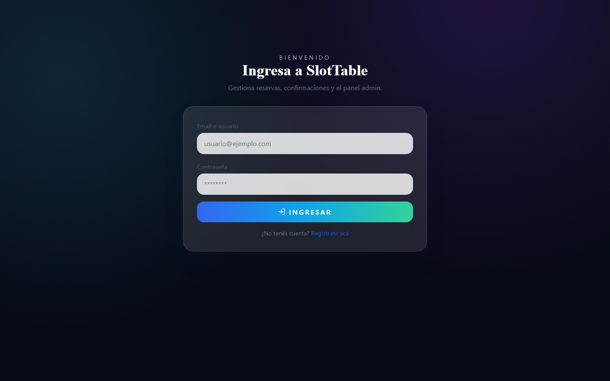
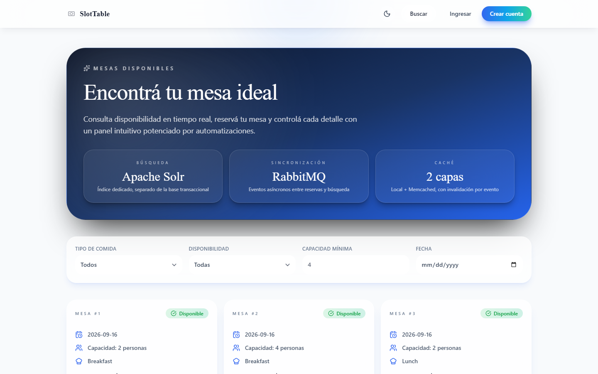
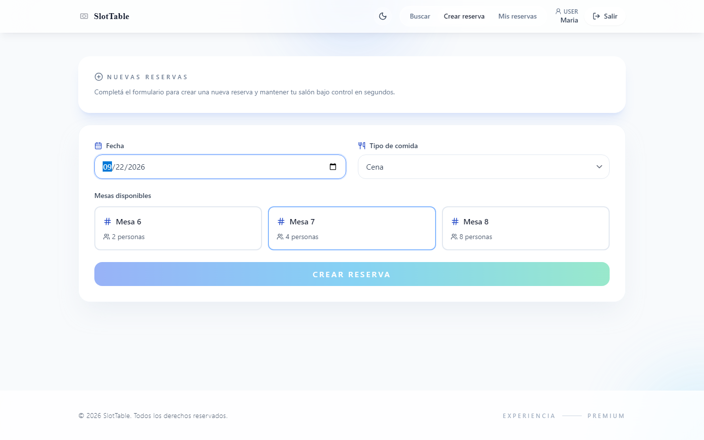
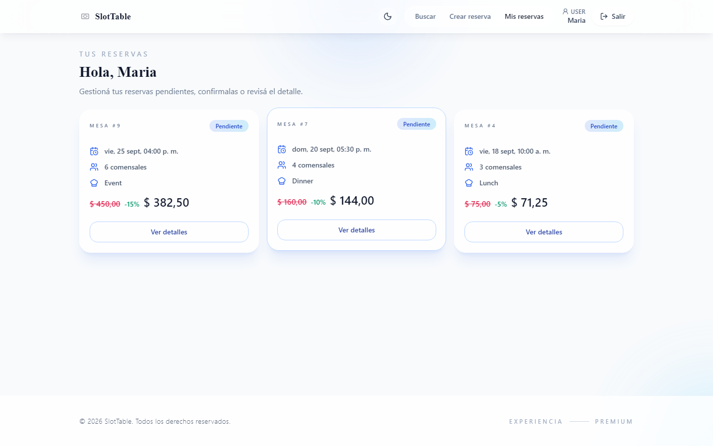
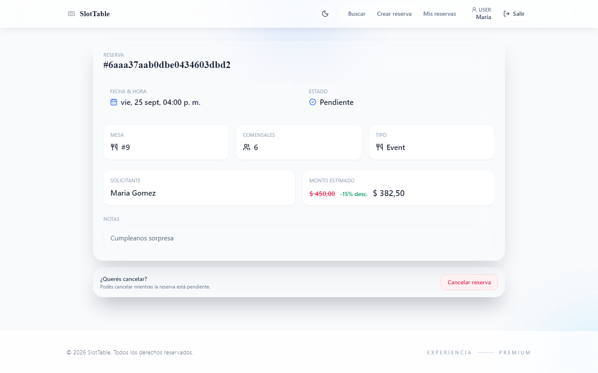
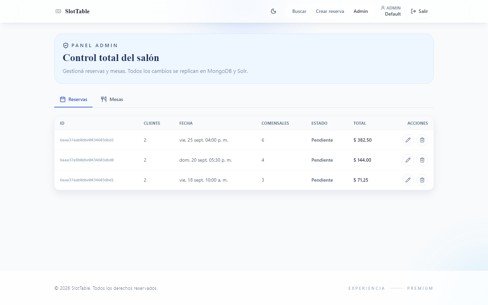
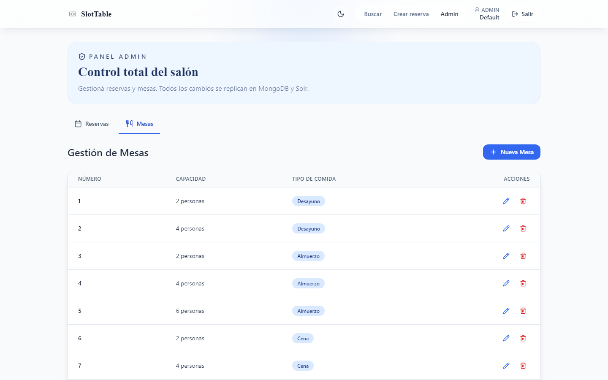
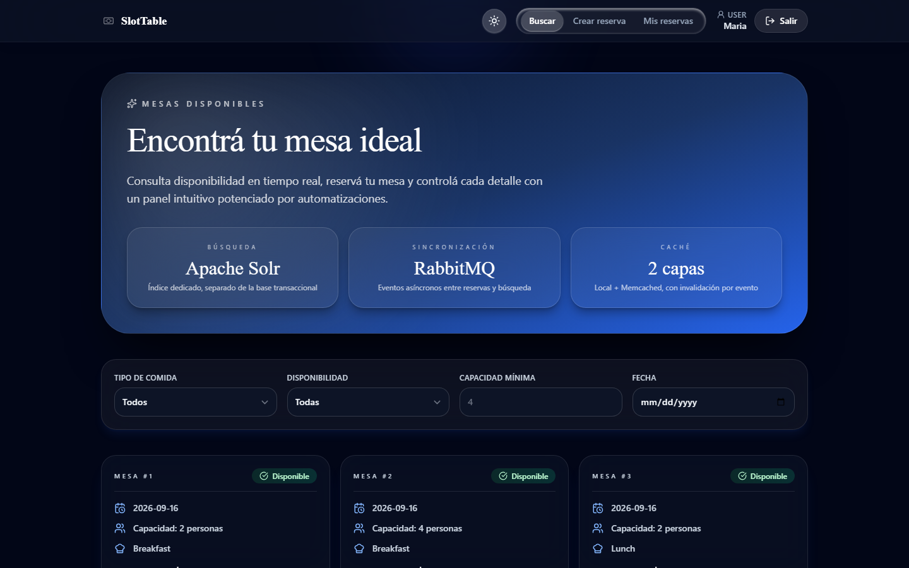
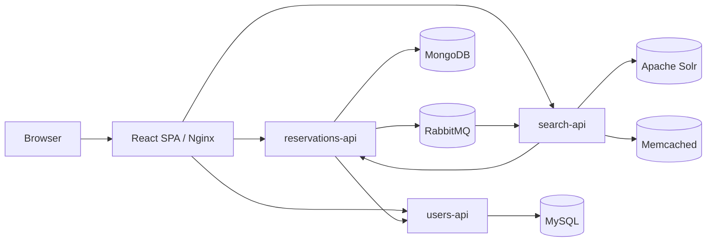

<p align="center">
  
</p>

<h1 align="center">SlotTable</h1>

<p align="center">
  <a href="https://github.com/lucasrodrich/SlotTable-ProyectoArquitecturaDeSoftwareII/actions/workflows/ci.yml"></a>
  
  
  
  
  
</p>

---

## What problem this solves

A restaurant reservation platform looks trivial until it has to handle real load: customers searching availability far more often than they actually book, table state that must stay consistent across concurrent reservations, and admin operations that can't be allowed to interfere with the customer-facing flow. SlotTable is a distributed implementation of that problem — write-heavy reservation management and read-heavy availability search are handled by separate services with separate storage, kept in sync through asynchronous events instead of a shared database.

This was built as the final project for **Arquitectura de Software II** (Universidad Católica de Córdoba) by a 4-person team. The tech stack (Go, MySQL, MongoDB, Solr, RabbitMQ, dual-layer caching, React, Docker Compose) was specified by the assignment; the decisions below are about how we used it, not whether to use it.

## Screenshots

| | |
|---|---|
|  Login |  Home / search |
|  Home filtered (dinner) |  Create reservation |
|  My reservations |  Reservation details |
|  Admin dashboard |  Admin tables |
|  Home (dark mode) | |

## Architecture



| Service | Responsibility | Storage / dependency |
|---|---|---|
| `users-api` | Registration, login, JWT issuance, roles | MySQL (via GORM) |
| `reservations-api` | Reservations, tables, pricing, lifecycle events | MongoDB, RabbitMQ, calls `users-api` |
| `search-api` | Availability search, Solr indexing, caching | Apache Solr, Memcached, consumes RabbitMQ |
| `frontend` | React SPA | Calls all three APIs directly |

Reservation writes go to `reservations-api` and MongoDB; `reservations-api` publishes a change event to RabbitMQ; `search-api` consumes it, re-reads the reservation and table data by ID (for consistency) and updates the Solr document. Search reads never touch MongoDB — they go through a local cache, then Memcached, then Solr.

## Design decisions

**Polyglot persistence (MySQL for users, MongoDB for reservations).** The assignment required this split, but it maps onto a real distinction: user identity is small, relational, and rarely changes shape, while reservation data (guests, tables, pricing snapshots, special requests) is closer to a document. Splitting them means each service owns its schema independently.

**Solr as a dedicated read model, synced via RabbitMQ instead of read from MongoDB directly.** `search-api` never queries `reservations-api`'s database. It maintains its own indexed copy, updated asynchronously when reservation events arrive. This decouples search latency from write load, at the cost of eventual consistency between a reservation being created and it disappearing from search results — search-api re-fetches the source record by ID on every event specifically to reduce that window.

**Concurrent request handling in the pricing/availability path.** `reservations-api`'s `CalculateReservationConcurrent` (`reservations-api/internal/domain/calculation.go`) runs availability check, base price and discount calculation as three goroutines synchronized with a `sync.WaitGroup` and collected over a channel, as the assignment's concurrency requirement asked for. Worth noting honestly: each goroutine's "work" is a simulated `time.Sleep`, not real I/O or computation — the pattern is real, the workload behind it is a stand-in.

## What I'd do differently

- The three goroutines in the pricing calculation don't do independent real work (no external calls, no heavy computation), so the concurrency doesn't buy real latency — it demonstrates the pattern the assignment asked for, but a production version would only split work that's actually parallelizable (e.g., the availability check and an external pricing/tax service call).
- No OpenAPI/contract documentation per service, no integration tests running the full Docker Compose stack, and no centralized/structured logging or tracing across services — debugging a cross-service issue today means reading logs from three separate containers by hand.
- Secrets are handled via plain `.env` files with dev defaults (including one committed `.env` per service) — fine for a course project, not how I'd manage secrets in anything real.
- No migration/versioning strategy for the MongoDB schema or the Solr index definition — schema changes today mean manually recreating both.

## Running it

<details>
<summary>Docker Compose (full stack)</summary>

```bash
docker compose up --build
```

| Resource | URL |
|---|---|
| Frontend | http://localhost:3000 |
| Users API | http://localhost:8080 |
| Reservations API | http://localhost:8081 |
| Search API | http://localhost:8082 |
| RabbitMQ Management | http://localhost:15672 |
| Solr Admin | http://localhost:8983 |
| Adminer | http://localhost:18080 |
| Mongo Express | http://localhost:18081 |

Stop everything: `docker compose down` (add `-v` to also drop volumes).

Seeded dev admin: `admin@admin.com` / `12345678`. RabbitMQ dev credentials: `admin` / `admin`. Both are local-only defaults from `docker-compose.yml` — not meant to be reused anywhere else.

</details>

<details>
<summary>Frontend only (outside Docker)</summary>

```bash
cd frontend
cp .env.example .env   # then adjust VITE_API_URL / VITE_RESERVATIONS_API_URL / VITE_SEARCH_API_URL if needed
npm install
npm run dev
```

</details>

<details>
<summary>Backend services (outside Docker)</summary>

Each service needs Go 1.24+ and its own datastore reachable (MySQL for `users-api`; MongoDB, RabbitMQ for `reservations-api`; Solr, Memcached, RabbitMQ for `search-api`).

```bash
cd users-api && go run ./cmd/server
cd reservations-api && go run ./cmd/api
cd search-api && go run ./cmd/api
```

</details>

<details>
<summary>Tests</summary>

```bash
cd users-api && go test ./...
cd ../reservations-api && go test ./...
cd ../search-api && go test ./...
```

Coverage: `go test -v -coverprofile=coverage.out ./... && go tool cover -html=coverage.out -o coverage.html`

</details>
